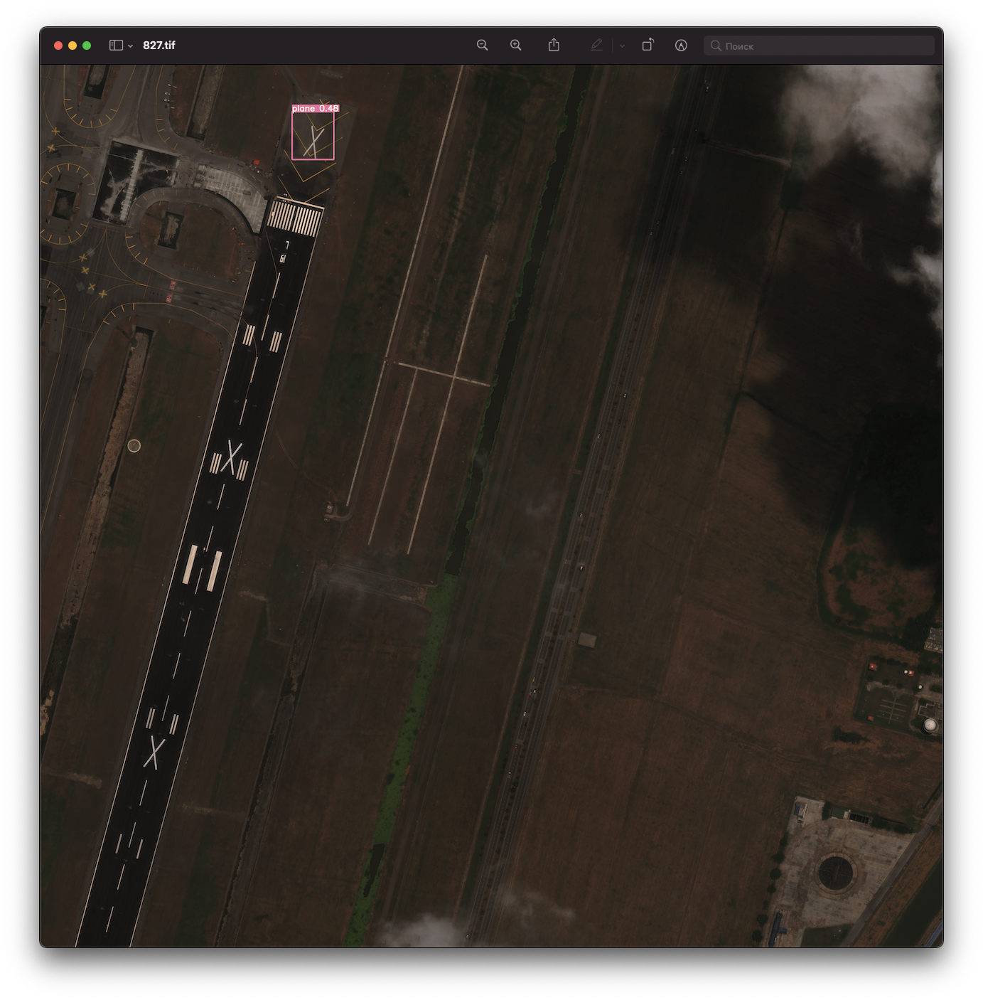

# YOLOv5l & xView DataSet 

[](https://nodesource.com/products/nsolid)

[](https://travis-ci.org/joemccann/dillinger)

Тестирование производиловь на тестовой выборке xView, с предобученной моделью YOLOv5l на обучающей выборке DOTA. В тестировании исследовались следующие параметры:

  - Разрешение изображения (640х640, 1024х1024, 2048х2048, 3096х3096)
  - Достоверность обнаружения (conf: 0.1, 0.25, 0.4, 0.7)
  - Весовые коэффициенты (best.pt, last.pt, dota.pt)

# Результаты тестирования

### Разрешение 1024x1024, conf 0.4, dota.pt
 
 
 
### Разрешение 640x640, conf 0.4, best.pt
 
 
 
### Разрешение 1024x1024, conf 0.1, best.pt
 
 
 
### Разрешение 2048x2048, conf 0.4, best.pt
 
 
 
 
# Выводы

>Увеличение разрешения изображения повышет точность обнаружения, но при этом повышается процент ложных срабатываний, которые можно сократить за счет увеличения коэфициента доставерности conf. Важно! Увеличение разрешения изображения значительно снижает быстродействие детектирования (например, увеличение разрешения в 2 раза, снижает быстродействие в 4 раза).

## Направление дальнейших исследований
* Провести обучение модели на обучающей выборке xView
* Провести исследования на различных моделях YOLOv5 (s, m, l, x)
* Провести эксперементальные исследования с предобработкой изображения (выделение контуров, повышение контрвста и т.п.)

### Как пользоваться

Настройка параметров производится в конфигурационном файле conf.json
Вам также понадобиться установить Python3.8, PyTorch 1.7.0, nampy19.2, python-opencv(last version). Подробнее на [PyTorch.org](https://pytorch.org/)
Для запуска скрипта необходимо набраать:

```sh
$ cd /../CNN/YOLOv5
$ python main.py
```
Так же можно воспользоваться готовым репозиторием [Ultralystic](https://github.com/ultralytics/yolov5)
